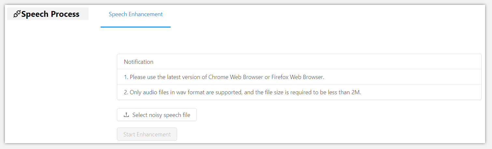

This project is a demonstration of the paper *A robust speech enhancement approach based on deep adversarial learning for extremely low signal-to-noise condition*.

## Usage

Visit this [link](http://202.207.12.159:9000) to enter the demo page. You can select the noisy speech by clicking the button "Select noisy speech" and click the "Start enhancement" button to upload the noisy speech to our model. After the model denoises the speech, the button "Download enhanced speech" will appear on the page. You can click this button to download the enhanced speech.

#### Note

1. The size of the uploaded file is 2MB or less, and the format is required to be wav format. The recommended sampling rate is 44100Hz. According to the characteristics of the model, the recommended SNR of the noisy speech is -10~-15dB.
2. You can use [STOI](https://github.com/mpariente/pystoi) (Short-Time Objective Intelligibility) and [PESQ](https://www.itu.int/rec/T-REC-P.862) (Perceptual evaluation of speech quality) as measures to evaluate the quality and intelligibility of the enhanced speech separately.
3. Please use the latest version of modern browsers, such as the latest version of [Google Chrome](https://www.google.com/chrome/), [Firefox](https://www.mozilla.org/en-US/firefox/new/).

## Model characteristics

The model has been described in detail in the paper, and only some of the characteristics of the model are emphasized here.

### Small training dataset

The [TIMIT](https://catalog.ldc.upenn.edu/LDC93S1) and [NOISEX-92](http://spib.linse.ufsc.br/noise.html) corpus are used in the experiment. The TIMIT corpus is used as the clean database and the NOISEX-92 corpus are used as interference, respectively. We randomly select 40 speakers from the TIMIT corpus and then use the first 7 sentences of each speaker as the training utterance. We employ babble, factoryfloor1, destroyerengine and destroyerops from NOISEX-92 corpus for training. We mix the 280 utterance with these noise under 0dB, -5dB, -10dB and -15dB SNRs to create the training dataset. The training dataset of the model is very small.

### Extremely Low SNR conditions

Our model performs very well at extremely low SNR conditions. The current SNR conditons tested include: -3dB, -5dB, -7dB, -10dB, -12dB and -15dB. Even our model is not trained under some low SNR conditions, such as -3dB, -7dB and -12dB.
